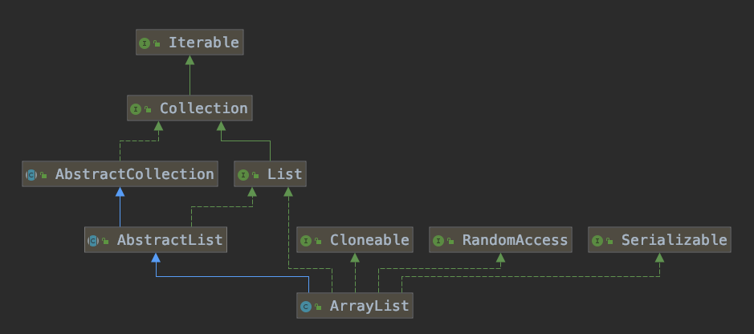

# ArrayList


## 概述

`ArrayList`是一个能够存储任何元素(允许存放null)的容器，容器的大小是可变的，当`ArrayList`容器中的元素数量到达阈值。

`ArrayList`能够自动扩容;由于`ArrayList`的内部是由`Object[]`数组构成的，所以从`ArrayList`中查找元素会很快，元素可以通过数组

的下标index找到。`ArrayList`集合不是线程安全的，在多线程使用的时候需要注意。

## 继承结构



## 构造器

1. ArrayList()

   ```java
   /**
    * 将Object数组elementData初始化一个空数组，在这里还没有设置大小size
    */
   transient Object[] elementData;
   // 默认为空的数组
   private static final Object[] DEFAULTCAPACITY_EMPTY_ELEMENTDATA = {};
   public ArrayList() {
        this.elementData = DEFAULTCAPACITY_EMPTY_ELEMENTDATA;
   }
   ```

2. ArrayList(int initialCapacity)

   ```java
   /**
    * 构造一个给定大小的空数组
    */
   private static final Object[] EMPTY_ELEMENTDATA = {};
   public ArrayList(int initialCapacity) {
       if (initialCapacity > 0) {
           this.elementData = new Object[initialCapacity];
       } else if (initialCapacity == 0) {
           this.elementData = EMPTY_ELEMENTDATA;
       } else {
           throw new IllegalArgumentException("Illegal Capacity: "+ initialCapacity);
       }
   }
   ```

3. ArrayList(Collection<? extends E> c)

   ```java
   /** 
    * 初始化一个给定的包含元素的集合的列表
    */
   public ArrayList(Collection<? extends E> c) {
       // 首先将传入的集合转成数组
       elementData = c.toArray();
       if ((size = elementData.length) != 0) {
           // c.toArray might (incorrectly) not return Object[] (see 6260652)
           if (elementData.getClass() != Object[].class)
               elementData = Arrays.copyOf(elementData, size, Object[].class);
       } else {
           // replace with empty array.
           this.elementData = EMPTY_ELEMENTDATA;
       }
   }
   ```

## 集合操作

1. add 添加元素

```java
/**
 * 在列表的最后追加一个给定的元素
 * Appends the specified element to the end of this list.
 */
public boolean add(E e) {
    ensureCapacityInternal(size + 1);  // Increments modCount!!
    // 在数组的后面添加元素，并且 集合中元素数量+1
    elementData[size++] = e;
    return true;
}
private void ensureCapacityInternal(int minCapacity) {
    ensureExplicitCapacity(calculateCapacity(elementData, minCapacity));
}

private static int calculateCapacity(Object[] elementData, int minCapacity) {
    // 如果数组还是空数组(刚初始化)则返回默认容量10
    if (elementData == DEFAULTCAPACITY_EMPTY_ELEMENTDATA) {
        return Math.max(DEFAULT_CAPACITY, minCapacity);
    }
    return minCapacity;
}

private void ensureExplicitCapacity(int minCapacity) {
    // 修改的次数加1
    modCount++;
    // overflow-conscious code 
    // ArrayList扩容时机，只有当期望的最小容量大于当前数组的长度才会触发扩容
    // 一般来说，最小容量minCapacity是当前列表中包含元素的个数+1,也就是size+1,
    // 如果数组是通过无参构造器初始化，则minCapacity为默认的容量10
    if (minCapacity - elementData.length > 0)
            grow(minCapacity);
}
/**
 * ArrayList的扩容方法，minCapacity为期望的最小容量，
 */
private void grow(int minCapacity) {
    // overflow-conscious code
    int oldCapacity = elementData.length;
    // oldCapacity >> 2   表示   oldCapacity / 2
    int newCapacity = oldCapacity + (oldCapacity >> 1); // 原来容量 + 原来容量的一半
    // 如果新扩容量的大小小于期望最小容量，list的容量设置为最小容量
    if (newCapacity - minCapacity < 0)
        newCapacity = minCapacity;
    // 如果扩容后的容量大于数组的最大容量，则将容量设置为最大容量，MAX_ARRAY_SIZE = Integer.MAX_VALUE - 8
    if (newCapacity - MAX_ARRAY_SIZE > 0)
        newCapacity = hugeCapacity(minCapacity);
    // minCapacity is usually close to size, so this is a win:
    // 将扩容后的数组大小复制一份并覆盖原来的数组,数组中的元素也copy到了新的数组，数组的长度变成了新的数组大小
    elementData = Arrays.copyOf(elementData, newCapacity);
}
```

```java
/**
 * 在特定的下标处添加给定的数组元素element
 * 和上面方法的区别在于，该方法会在真正add之前去校验index，越界了则会抛出异常，另外一个就该方法不依赖于size来append，
 * 而是通过System.arraycopy来完成添加
 */

public void add(int index, E element) {
    rangeCheckForAdd(index);
		
    ensureCapacityInternal(size + 1);  // Increments modCount!!
    System.arraycopy(elementData, index, elementData, index + 1,
                     size - index);
    elementData[index] = element;
    size++;
}
```

2. remove 移除元素

```java
/**
 * 根据下标删除元素
 */
  
public E remove(int index) {
    // 校验数组下标是否越界，如果index > size则抛出IndexOutOfBoundsException
    rangeCheck(index);
    modCount++;
    // 获取数组下标为index的数组元素
    E oldValue = elementData(index);
    int numMoved = size - index - 1;
    if (numMoved > 0)
        // System.arraycopy 为native方法，依然通过复制来进行移除元素,然后将elementData指向复制后的数组
        System.arraycopy(elementData, index+1, elementData, index, numMoved);
    // 利于垃圾回收
    elementData[--size] = null; // clear to let GC do its work
    return oldValue;
}
```

```java
/**
 * 根据提供的元素删除元素
 */
public boolean remove(Object o) {
    // 因为ArrayList是支持null元素的所以需要对null单独做处理,如果不对null单独处理就会下面的equals方法就会抛出空指针异常
    if (o == null) {
        for (int index = 0; index < size; index++)
            if (elementData[index] == null) {
                fastRemove(index);
                return true;
            }
    } else {
        for (int index = 0; index < size; index++)
            if (o.equals(elementData[index])) {
                fastRemove(index);
                return true;
            }
    }
    return false;
}

private void fastRemove(int index) {
    modCount++;
    int numMoved = size - index - 1;
    if (numMoved > 0)
        System.arraycopy(elementData, index+1, elementData, index,
                         numMoved);
    elementData[--size] = null; // clear to let GC do its work
}
```

3. get 获取元素

```java
/**
 * 通过下标随机访问数组中的元素
 */
public E get(int index) {
    // 校验index是否越界
    rangeCheck(index);
    // 通过数组下标获取数组中的元素
    return elementData(index);
}

E elementData(int index) {
    return (E) elementData[index];
}
```


## 总结

1. `ArrayList`集合查找元素快，移动元素需要复制然后覆盖之前的数组集合，因此ArrayList移动删除/添加元素慢
2. `ArrayList`是非线程安全的类，在多线程代码中谨慎使用
3. `ArrayList`集合容器的默认容量是10，进行扩容后的大小为： 原来容器大小 + 原来容器大小的一半
4. `ArrayList`允许添加null
5. `ArrayList`的扩容时机：只有当期望的最小的容量大于当前数组的长度才会触发扩容

