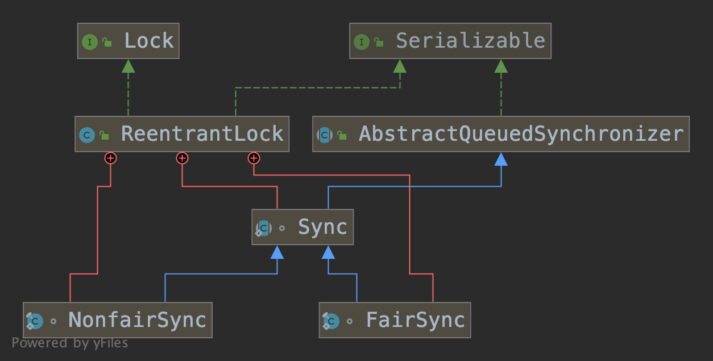

# ReentrantLock

## 概述

`ReentrantLock`是一个**可重入**的互斥的锁，它和隐含的监视器锁使用`synchronized`同步方法相同，`RenentrantLock`提供了

`tryLock()`、`lock()`、`unlock()`等方法来获取/释放共享资源，提供了更多的扩展能力。`ReentrantLock`可以通过构造器参数来

确定ReentrantLock是公平锁还是非公平锁，ReentrantLock的默认无参构造器实现的是非公平锁。

## 继承结构

`ReentrantLock`实现了`Lock`接口和`Serializable`接口，它包含了`Sync`静态抽象内部类、`NonfairSync`静态内部类、`FairSync`静态内

部类。`NonfairSync`和`FairSync`都继承了`Sync`，然后`Sync`再通过继承`AbstractQueuedSynchronizer`来构建一个同步器，AQS通过对

共享资源state状态的控制来实现同步操作。



## 构造器

```java
/** 
 * 无参构器默认创建一个非公平锁
 */
public ReentrantLock() {
    sync = new NonfairSync();
}
/**
 * 通过传入的fair来确定创建的是一个公平锁还是非公平锁
 * true : 公平锁
 * fale : 非公平锁
 */
public ReentrantLock(boolean fair) {
    sync = fair ? new FairSync() : new NonfairSync();
}

```

## lock 获得锁

`RenentrantLock`中的`lock`方法具体实现都委托给了`Sync`来完成。非公平锁和公平锁有不同的lock逻辑

```java
/** 根据不同的sync来获得锁，公平锁和非公平锁的逻辑略微会有些不同 **/
public void lock() {
    sync.lock();
}
```

1. 非公平锁

```java
// java.util.concurrent.locks.ReentrantLock.NonfairSync#lock
final void lock() {
    // 先通过cas看能不能获取到锁，如果cas成功，将当前线程设置为互斥拥有线程，cas失败了则通过acquire获得锁
    if (compareAndSetState(0, 1))
        setExclusiveOwnerThread(Thread.currentThread());
    else
        acquire(1);
}
/** 
 * java.util.concurrent.locks.AbstractQueuedSynchronizer#acquire
   该方法的调用为AQS的方法，在AQS再进行分析，目前只需要知道
 */
public final void acquire(int arg) {
    if (!tryAcquire(arg) &&
        acquireQueued(addWaiter(Node.EXCLUSIVE), arg))
        selfInterrupt();
}

protected final boolean tryAcquire(int acquires) {
    return nonfairTryAcquire(acquires);
}


final boolean nonfairTryAcquire(int acquires) {
    // 获取当前线程
    final Thread current = Thread.currentThread();
    // 获取AQS中共享资源state，state == 0表示还没有线程获得锁资源
    int c = getState();
    if (c == 0) {
        // state == 0表示还没有线程获得锁资源,可以直接通过CAS设置共享资源state的状态，CAS有可能会失败
        if (compareAndSetState(0, acquires)) {
            setExclusiveOwnerThread(current);
            return true;
        }
    }
    else if (current == getExclusiveOwnerThread()) {
        int nextc = c + acquires;
        if (nextc < 0) // overflow
            throw new Error("Maximum lock count exceeded");
        setState(nextc);
        return true;
    }
    return false;
}
```


